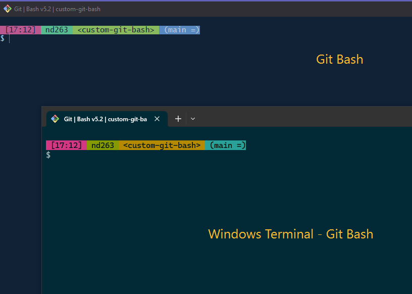

# Custom Git Bash scripts

## Steps to customise your Git Bash prompt
  
  1. Copy existing `git-prompt.sh` file from `C:\Program Files\Git\etc\profile.d`.
  2. Create a new folder called `.config\git` at `C:\Users\<YOUR_USERNAME>\`. If `.config` folder exist than create a `git` folder inside `.config`.
  3. Copy and Paste `git-prompt.sh` from this repository (`\custom-prompts\git-prompt.sh`)
